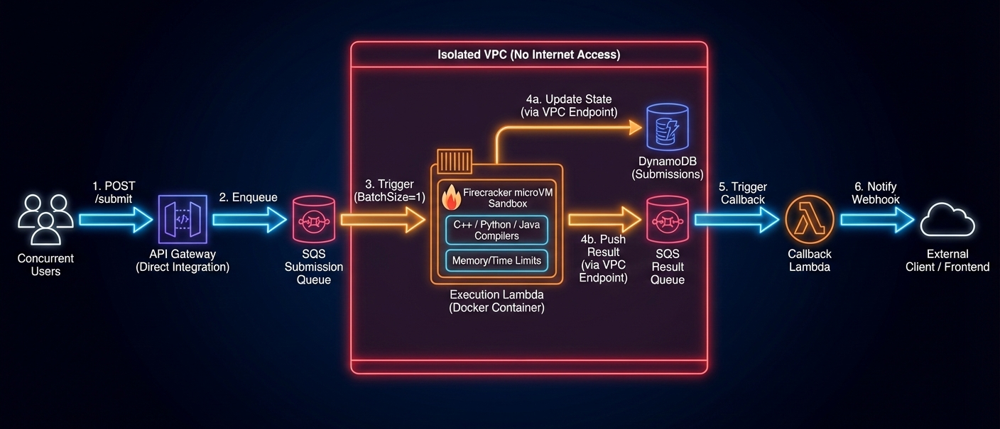

# Serverless Judge Engine

A highly scalable, 100% serverless online judge. This architecture leverages AWS Lambda's native **Firecracker microVMs** to provide secure, isolated execution environments for untrusted user code without the overhead of managing EC2 instances or complex container sandboxing tools.


### ✨ Key Features & Strategic Advantages

* **Massive Concurrency via SQS:** API Gateway maps `POST` requests directly into an SQS queue. This buffers thousands of simultaneous users submissions during peak traffic (like live contests) without throttling or dropping requests.
* **Native Kernel-Level Security:** Bypasses Fargate limitations by using AWS's own Firecracker microVMs as the ultimate security boundary. Timeouts (TLE) and Memory Limits (MLE) are enforced natively by AWS.
* **1:1 Execution Isolation:** SQS batch size is strictly set to `1`, guaranteeing each Lambda microVM handles only one user's code at a time to completely prevent memory cross-contamination.
* **Multi-Language Runtimes:** Native support for compiling and executing **C++, Python, Java, Node.js, and Go** within a single, optimized Lambda Docker image.
* **Zero Trust Execution:** Automatically destroys `/tmp` workspaces after every run and strips AWS IAM environment variables before executing user code to prevent privilege escalation.

### 💰 Cost Efficiency

* **Ultra-Low Cost at Early Scale:** Approx **2,500 submissions/day -> ~$0.08**
* **Zero Idle Cost:** The system scales to exactly zero. You pay $0.00 when users are not submitting code, making it infinitely cheaper than provisioned EC2 instances for spiky traffic.

---

### 📂 Project Structure

```text
codekai-serverless/
├── infrastructure/       # Terraform IaC (API Gateway, SQS, DynamoDB, Lambda, VPC)
│   └── main.tf
└── worker/               # The Compute Layer
    ├── Dockerfile        # AWS Lambda base image with multi-lang compilers
    ├── requirements.txt
    └── lambda_function.py # Secure Execution Handler

```

---

### 🛠 Quickstart Deployment

**1. Create the ECR Repository (CLI)**
Terraform requires the image to exist before creating the Lambda function.

```bash
aws ecr create-repository --repository-name codekai-judge-lambda --region us-east-1

```

**2. Build and Push the Execution Environment**

```bash
cd worker
ACCOUNT_ID=$(aws sts get-caller-identity --query Account --output text)

# Login to ECR
aws ecr get-login-password --region us-east-1 | docker login --username AWS --password-stdin ${ACCOUNT_ID}.dkr.ecr.us-east-1.amazonaws.com

# Build and Push
docker build -t codekai-judge-lambda .
docker tag codekai-judge-lambda:latest ${ACCOUNT_ID}.dkr.ecr.us-east-1.amazonaws.com/codekai-judge-lambda:latest
docker push ${ACCOUNT_ID}.dkr.ecr.us-east-1.amazonaws.com/codekai-judge-lambda:latest

```

**3. Provision Infrastructure**

```bash
cd ../infrastructure
terraform init
terraform apply

```

**4. Test the API**
Use the API Gateway URL provided by the Terraform output:

```bash
curl -X POST https://[YOUR_API_ID].execute-api.us-east-1.amazonaws.com/v1/submit \
  -H "Content-Type: application/json" \
  -d '{
    "submissionId": "test-001",
    "language": "cpp",
    "sourceCode": "#include <iostream>\n int main() { std::cout << \"Hello CodeKai\"; return 0; }",
    "callback_url": ""
  }'

```